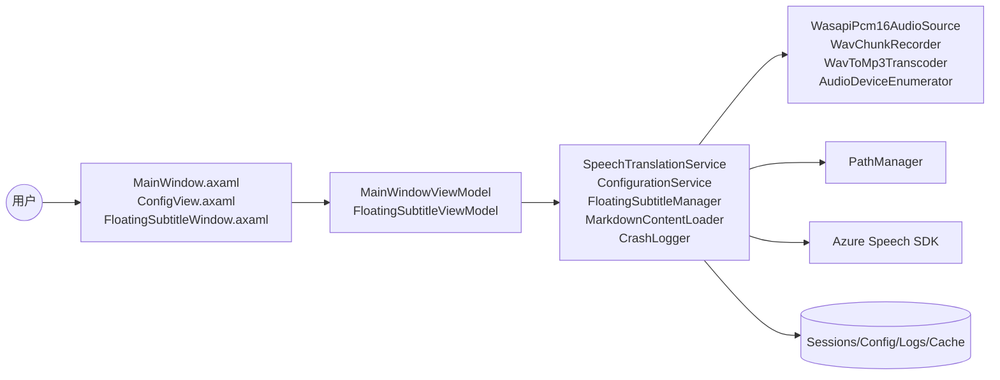
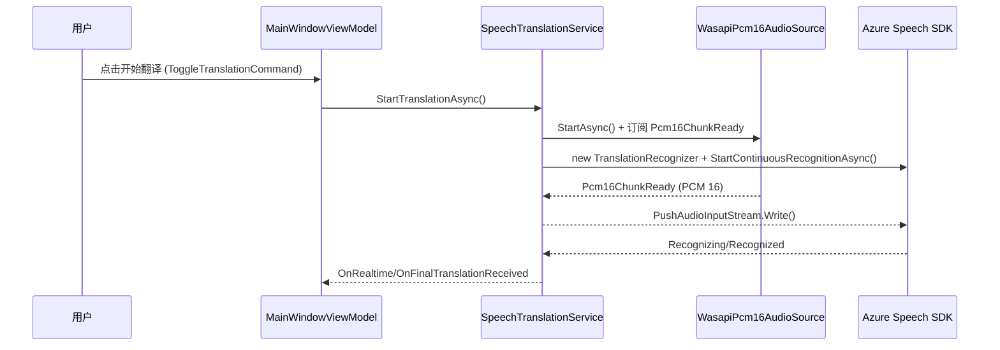
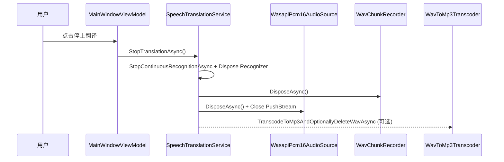
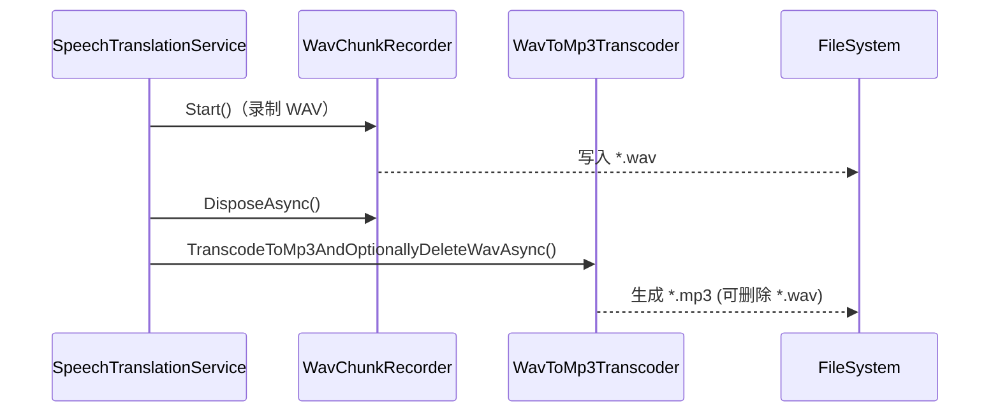
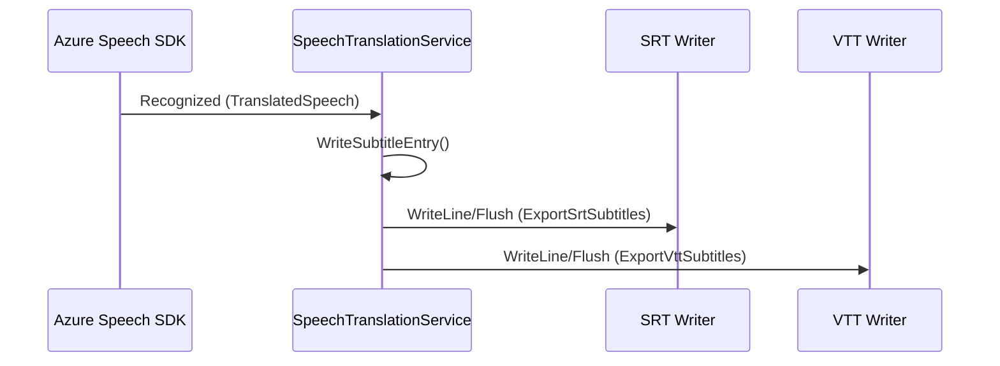
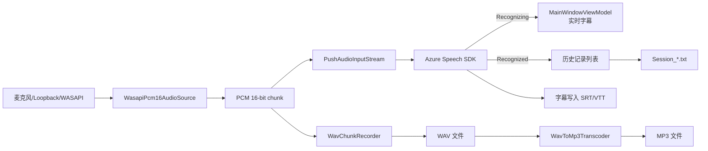

# TranslationToolUI 维护者技术说明（含 Mermaid 图）

> 受众：维护者/自己。目标是把“能从代码与现有文档验证的事实”汇总成可维护的技术全景，并把关键流程映射到具体文件与符号。

## 0. 事实来源索引（可追溯到文件/符号）

| ID | 来源文件 | 覆盖内容/事实 | 关键符号/入口 |
| --- | --- | --- | --- |
| F1 | README.md | 功能概览、平台限制、运行要求、About/Help 外置策略 | “平台与限制”“内容更新”章节 |
| F2 | PROJECT_DETAILS.md | 依赖版本、平台取舍、IconGen 构建期工具 | “依赖与版本”“IconGen”章节 |
| F3 | TranslationToolUI.csproj | TargetFramework、NuGet 版本、IconGen 任务 | `<TargetFramework>net10.0</TargetFramework>`、`PackageReference`、`GenerateAppIconIco` |
| F4 | Program.cs | 进程入口、CrashLogger 初始化 | `Program.Main` |
| F5 | App.axaml.cs | Avalonia 初始化与主窗体创建 | `App.OnFrameworkInitializationCompleted` |
| F6 | MainWindow.axaml / MainWindow.axaml.cs | 主界面结构、按钮与命令绑定、双击字幕回放 | `MainWindow`、`HelpButton_Click` |
| F7 | ViewModels/MainWindowViewModel.cs | 主业务状态机、翻译起停、音频/字幕复盘、配置/历史 | `StartTranslation`、`StopTranslation`、`RefreshAudioDevices` |
| F8 | Services/SpeechTranslationService.cs | 语音识别/翻译、录音、字幕输出、重连 | `StartTranslationAsync`、`OnRecognized`、`CleanupAudioAsync` |
| F9 | Services/Audio/WasapiPcm16AudioSource.cs | WASAPI 音频采集、PCM 16 推流 | `StartAsync`、`Pcm16ChunkReady` |
| F10 | Services/Audio/WavChunkRecorder.cs | WAV 写入与缓冲 | `Start`、`TryEnqueue`、`StopAsync` |
| F11 | Services/Audio/WavToMp3Transcoder.cs | WAV→MP3 转码（Windows MF） | `TranscodeToMp3AndOptionallyDeleteWavAsync` |
| F12 | Services/Audio/AudioDeviceEnumerator.cs | 设备枚举与默认设备 | `GetActiveDevices` |
| F13 | Services/ConfigurationService.cs | JSON 配置读写 | `LoadConfigAsync`、`SaveConfigAsync` |
| F14 | Services/PathManager.cs | AppData/Session/Logs/Cache 路径策略 | `PathManager.Instance` |
| F15 | Models/AzureSpeechConfig.cs | 配置结构、订阅/录音/字幕参数 | `AzureSpeechConfig` |
| F16 | Views/ConfigView.axaml(.cs) | 订阅管理与配置项 UI | `ConfigView` |
| F17 | Services/FloatingSubtitleManager.cs | 浮窗字幕生命周期 | `ToggleWindow`、`UpdateSubtitle` |
| F18 | Services/SubtitleSyncService.cs | 浮窗字幕同步 | `UpdateSubtitle` |
| F19 | ViewModels/FloatingSubtitleViewModel.cs | 浮窗字幕显示处理 | `OnSubtitleUpdated` |
| F20 | Services/CrashLogger.cs | 崩溃日志路径与写入 | `CrashLogger.Init` |
| F21 | Services/MarkdownContentLoader.cs | About/Help Markdown 载入策略 | `LoadMarkdown` |

> 空白提示：需求中提到的 `netxtui.md` 在仓库内未找到（`glob **/*netxtui*.md` 无匹配）。相关 UI/交互意图仅能从 `MainWindow.axaml` 与 `ConfigView.axaml` 推断。

## 1. 技术栈、依赖与平台限制

- UI 框架：Avalonia 11.x（F2/F3）。
- 语音识别与翻译：Azure Speech SDK（Microsoft.CognitiveServices.Speech 1.44.0）（F2/F3/F8）。
- 音频采集：NAudio 2.2.1；WASAPI Loopback 仅 Windows（F1/F2/F9/F12）。
- 录音转码：Windows Media Foundation，非 Windows 平台直接抛出 `PlatformNotSupportedException`（F11）。
- 运行时：`.NET 10 Desktop Runtime`（F1/F2/F3）。
- Markdown 渲染：Markdown.Avalonia；About/Help 可外置（F1/F2/F21）。

平台限制总结：

- WASAPI Loopback 与 MP3 转码是 Windows 能力；非 Windows 平台会回退默认麦克风且不会本地录音（F1/F8/F9/F11）。
- 代码按跨平台组织，但 Android/iOS 路径尚未实现（F14）。

## 2. 主干架构与模块关系（系统架构图）

映射说明（关键依赖）：

- UI → ViewModel：`MainWindow.axaml` 通过命令绑定触发 `MainWindowViewModel`（F6/F7）。
- ViewModel → Service：`StartTranslation`/`StopTranslation` 调用 `SpeechTranslationService`（F7/F8）。
- Service → Audio：WASAPI 采集与 PCM 推流、录音与转码（F8–F11）。
- Service → Path/Files：会话、字幕与日志落盘路径（F8/F13/F14/F20）。

## 3. 入口与生命周期

1. `Program.Main` 初始化 `CrashLogger` → 构建 Avalonia App → `StartWithClassicDesktopLifetime`（F4）。
2. `App.OnFrameworkInitializationCompleted` 创建 `MainWindow`（F5）。
3. `MainWindow` 构造：加载 XAML、设置窗口图标、创建并绑定 `MainWindowViewModel`（F6）。
4. 窗口关闭：`MainWindow.OnClosed` 调用 `MainWindowViewModel.Dispose()`（F6/F7）。

## 4. 视图-视模型-服务依赖链

- 主界面 `MainWindow.axaml` → `MainWindowViewModel`：翻译起停、设备选择、历史与复盘（F6/F7）。
- 配置窗口 `ConfigView` → `AzureSpeechConfig`：订阅、录音、字幕、超时等参数编辑（F16/F15）。
- 浮窗字幕：`FloatingSubtitleManager` 创建 `FloatingSubtitleWindow` + `FloatingSubtitleViewModel`，通过 `SubtitleSyncService` 同步字幕（F17–F19）。

## 5. 语音翻译核心链路（运行时流程）

核心流程（`StartTranslation` → `SpeechTranslationService.StartTranslationAsync`）：

1. `MainWindowViewModel.StartTranslation` 创建 `SpeechTranslationService` 并订阅事件；构造函数内创建 `Session_*.txt` 会话文件（F7/F8）。
2. `SpeechTranslationService.StartTranslationAsync`：
   - 创建音频配置：Windows → `WasapiPcm16AudioSource` + PushStream；非 Windows → 默认麦克风（F8/F9）。
   - 根据配置启动 WAV 录音（`WavChunkRecorder`）与字幕输出（SRT/VTT）（F8/F10）。
   - 创建 `TranslationRecognizer` 并启动 `StartContinuousRecognitionAsync`（F8）。
3. 识别事件流：
   - `Recognizing` → `OnRealtimeTranslationReceived` → UI 实时更新（F8/F7）。
   - `Recognized` → 写入会话文件、输出字幕、历史入栈（F8/F7）。
4. 停止：`StopTranslationAsync` 停止识别、释放音频、字幕写入器与转码任务（F8）。

资源释放点（重点）：

- `StopTranslationAsync`：解除事件、Dispose `TranslationRecognizer`（F8）。
- `CleanupAudioAsync`：停止 WASAPI、关闭 PushStream、释放 `AudioConfig`，并触发 MP3 转码（F8/F9/F11）。
- `WavChunkRecorder.DisposeAsync`：确保写入线程完成（F10）。

## 6. 关键时序图（开始/停止/录音/字幕）

### 6.1 开始翻译

### 6.2 停止翻译与资源回收

### 6.3 录音转码（WAV→MP3）

### 6.4 字幕导出（SRT/VTT）

## 7. 数据与文件流（音频→识别→UI/文件）

## 8. 配置与持久化/路径策略

- 配置持久化：`ConfigurationService` 负责 `config.json` 的读取与保存（F13）。
- 配置模型：`AzureSpeechConfig` 包含订阅、语言、录音、字幕与超时参数（F15）。
- 路径策略：`PathManager` 将 AppData 下划分 `Sessions/Logs/Cache`；Android/iOS 尚未实现（F14）。
- UI 入口：`ConfigView` 提供订阅管理、录音/字幕/超时开关与会话目录（F16）。

## 9. 会话记录、字幕、媒体复盘

- 会话文本：`SpeechTranslationService.SaveTranslationToFile` 按 `Session_*.txt` 追加（F8）。
- 字幕输出：`InitializeSubtitleWriters` + `WriteSubtitleEntry` 输出 `.srt/.vtt`（F8）。
- 复盘 UI：`MainWindow.axaml` 的 “音频/字幕复盘”面板展示音频/字幕文件并支持播放（F6/F7）。
- 播放控制：`MainWindowViewModel` 使用 `AudioFileReader` + `WaveOutEvent`（F7）。

## 10. 浮窗字幕

- `FloatingSubtitleManager` 创建/关闭 `FloatingSubtitleWindow` 并通过 `SubtitleSyncService` 更新字幕（F17/F18）。
- `FloatingSubtitleViewModel` 处理文本裁剪、背景模式、字体颜色（F19）。

## 11. 异常日志

- `CrashLogger` 在应用启动时注册全局异常与 UI 线程异常，并写入 `logs` 目录（优先应用目录，其次 LocalAppData）。（F4/F20）

## 12. 发布与内容更新方式（现状）

- 构建期 IconGen 不影响主程序构建：`GenerateAppIconIco` 失败仅警告（F2/F3）。
- About/Help Markdown 优先读取可执行文件同目录，未找到再使用内置资源（F1/F2/F21）。
- `PROJECT_DETAILS.md` 仅给出“推荐默认发布 FDD”提示，具体参数尚未列出（F2）。

## 13. 空白/假设项（待维护者确认）

1. `netxtui.md` 未找到：若存在设计说明需补充到“UI/交互意图”章节。
2. `PROJECT_DETAILS.md` 的发布建议仅有一行“推荐默认发布 FDD”，缺少完整命令或运行时打包矩阵。
3. 多平台适配策略仅有路径占位（Android/iOS 未实现），音频链路未在非 Windows 验证。
