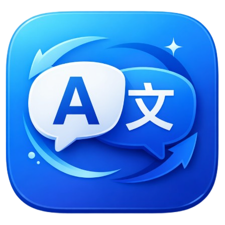

# 译见 Pro

我们做“译见 Pro”，不是为了一次翻译，而是为了让每一次交流都有价值被保存、被理解、被延展。
声音是最自然的语言，但它稍纵即逝；信息在现场生成，却常常在会后消散。于是我们开始思考：能否让声音留下结构、让对话沉淀洞察？

这就是“译见 Pro”的起点。
它把现场的声音转化为字幕，让信息即时可见；又用智能复盘把零散的片段整理为可追溯的结论、行动与风险。
不是为了替代思考，而是让思考被承载、被成文、被继续。

译以载言，智以成文。

> 🪟 说明：项目基于 Avalonia（理论可跨平台），但目前主要在 Windows 下开发；其他平台暂缺对应实现。

## 你会如何使用

- 线上会议与访谈：实时字幕与会话记录同步积累，支持会后复盘
- 跨语种内容理解：视频/课程/直播边看边译，信息不丢帧
- 现场记录与留存：录音与字幕联动，形成可追溯的资料
- 合规记录：录音前请确认已征得同意，并遵循所在地法律法规

## 功能概览

- 实时识别/翻译：中间结果与最终结果并行呈现
- 多输入源：麦克风 / 设备选择 / 系统回环（Loopback）
- 浮动字幕：置顶、轻量、不打断
- 会话录音：与字幕同步留存，支持后续整理
- 历史与复盘：会话归档、AI 复盘与批处理
- 配置持久化：一次设置，随时可用

## 内容更新（关于/帮助）

应用内“关于/帮助”内容来自 Markdown：

- 优先读取可执行文件同目录的 `About.md` / `Help.md`
- 外部文件不存在时回退到应用内置资源

如果你希望发布后可直接改文案（不重编译），可以在打包脚本里加 `-CopyExternalDocs`。

## 更多说明

- 详细说明与依赖版本/构建说明/平台限制：见 [PROJECT_DETAILS.md](PROJECT_DETAILS.md)

## 许可证

MIT，见 [LICENSE](LICENSE)

## 致谢

- [Avalonia UI](https://avaloniaui.net/)
- [Azure Speech Services](https://learn.microsoft.com/azure/ai-services/speech-service/)
