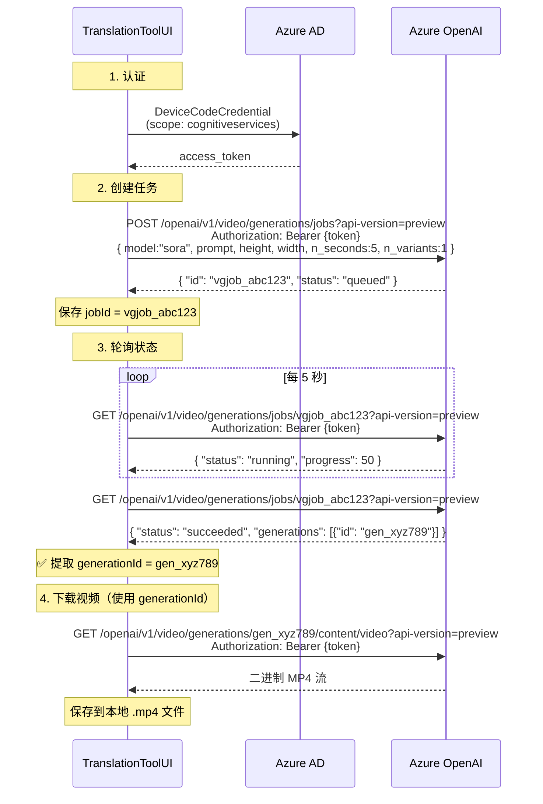
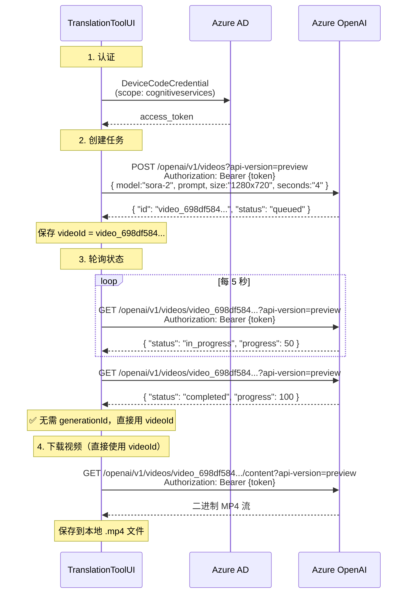

# Sora 与 Sora-2 视频生成 API 配置对比

> 本文档针对当前项目，使用C#编写的， Azure OpenAI + AAD 认证场景，详细对比两种视频生成 API 模式的架构差异、终结点规范、请求/响应格式、以及完整工作流程。

---

## 1. 架构总览

| 维度 | **sora**（SoraJobs 模式） | **sora-2**（Videos 模式） |
|---|---|---|
| 内部枚举 | `VideoApiMode.SoraJobs = 0` | `VideoApiMode.Videos = 1` |
| API 路径前缀 | `/openai/v1/video/generations/jobs` | `/openai/v1/videos` |
| 核心模型 | `sora`（1.0） | `sora-2` |
| 异步模式 | 是（创建 → 轮询 → **兑换** generationId → 下载） | 是（创建 → 轮询 → 直接用 videoId 下载） |
| 关键 ID | `jobId`（`vgjob_...`）+ `generationId`（`gen_...`） | `videoId`（`video_...`） |
| 成功终态 | `"succeeded"` | `"completed"` |
| 下载标识 | 需要 `generationId` 二次兑换 | 直接使用 `videoId` |
| 尺寸参数格式 | `width` + `height`（整数） | `size`（字符串，如 `"1280x720"`） |
| 时长参数 | `n_seconds`（**整数**） | `seconds`（**字符串**，如 `"4"`） |
| 数量参数 | `n_variants`（整数） | `n_variants`（整数，仅 > 1 时发送） |
| 可用分辨率 | 480p / 720p / 1080p，多种宽高比 | 仅 720p（1280×720 或 720×1280） |
| 可用时长 | 5 / 10 / 15 / 20 秒 | 4 / 8 / 12 秒 |
| 可用宽高比 | 16:9 / 9:16 / 1:1 / 4:3 / 3:4 | 仅 16:9 / 9:16 |
| 视频数量 | 1 / 2 / 4 | 仅 1 |

---

## 2. AAD 认证

两种模式共享相同的 AAD 认证机制。本项目使用 `Azure.Identity` 的 `DeviceCodeCredential`，认证记录持久化在 `%APPDATA%\TranslationToolUI\azure_auth_record.json`。

### 认证流程

```
1. 首次登录：DeviceCodeCredential → 用户打开浏览器输入设备码 → 获取 access_token
2. 后续请求：从 AuthRecord 静默刷新 token（无需交互）
3. Token scope: https://cognitiveservices.azure.com/.default
```

### 请求头设置

```csharp
// AAD 模式
request.Headers.Authorization = new AuthenticationHeaderValue("Bearer", accessToken);

// API Key 模式（对比参考）
request.Headers.Add("api-key", apiKey);
```

> **注意**：视频终结点可独立配置 `VideoAzureAuthMode`、`VideoAzureTenantId`、`VideoAzureClientId`，与图片/聊天终结点的认证配置互相独立。

---

## 3. 终结点详解

假设 `baseUrl` = `https://{resource}.openai.azure.com`

### 3.1 Sora（SoraJobs 模式）

| 操作 | HTTP 方法 | URL |
|---|---|---|
| 创建任务 | `POST` | `{baseUrl}/openai/v1/video/generations/jobs?api-version=preview` |
| 轮询状态 | `GET` | `{baseUrl}/openai/v1/video/generations/jobs/{jobId}?api-version=preview` |
| 下载（主） | `GET` | `{baseUrl}/openai/v1/video/generations/{generationId}/content/video?api-version=preview` |
| 下载（备） | `GET` | `{baseUrl}/openai/v1/video/generations/{generationId}/content?api-version=preview` |
| 下载（兜底） | `GET` | `{baseUrl}/openai/v1/video/generations/jobs/{jobId}/content?api-version=preview` |

### 3.2 Sora-2（Videos 模式）

| 操作 | HTTP 方法 | URL |
|---|---|---|
| 创建任务 | `POST` | `{baseUrl}/openai/v1/videos?api-version=preview` |
| 轮询状态 | `GET` | `{baseUrl}/openai/v1/videos/{videoId}?api-version=preview` |
| 下载（主） | `GET` | `{baseUrl}/openai/v1/videos/{videoId}/content?api-version=preview` |
| 下载（备） | `GET` | `{baseUrl}/openai/v1/videos/{videoId}/content/video?api-version=preview` |
| 下载（无版本号回退） | `GET` | `{baseUrl}/openai/v1/videos/{videoId}/content` |

> **关键差异**：Sora-2 不存在 `generationId` 的概念，所有操作直接使用创建时返回的 `videoId`。

---

## 4. 请求体格式

### 4.1 Sora 创建请求

```json
POST /openai/v1/video/generations/jobs?api-version=preview
Authorization: Bearer {aad_token}
Content-Type: application/json

{
  "model": "sora",
  "prompt": "金毛大战，草地，激烈场景",
  "height": 480,
  "width": 854,
  "n_seconds": 5,
  "n_variants": 1
}
```

> **注意**：`n_seconds` 是 **整数**，`width`/`height` 是**独立整数字段**。

### 4.2 Sora-2 创建请求

```json
POST /openai/v1/videos?api-version=preview
Authorization: Bearer {aad_token}
Content-Type: application/json

{
  "model": "sora-2",
  "prompt": "金毛大战，草地，激烈场景",
  "size": "1280x720",
  "seconds": "4"
}
```

> **注意**：
> - `seconds` 必须是 **字符串**（`"4"` / `"8"` / `"12"`），传整数会返回 400 错误
> - `size` 是 `"{width}x{height}"` 格式的字符串
> - `n_variants` 仅在 > 1 时可选发送（目前 sora-2 限制为 1）

---

## 5. 轮询响应格式

### 5.1 Sora 轮询响应

```json
GET /openai/v1/video/generations/jobs/{jobId}?api-version=preview

{
  "id": "vgjob_abc123",
  "status": "succeeded",
  "created_at": 1770000000,
  "model": "sora",
  "failure_reason": null,
  "generations": [
    {
      "id": "gen_xyz789"
    }
  ]
}
```

关键字段：
- `status`: 终态为 `"succeeded"`，失败为 `"failed"`
- `generations[0].id`: **下载所需的 generationId**（如 `gen_xyz789`）
- `failure_reason`: 失败原因描述

### 5.2 Sora-2 轮询响应

```json
GET /openai/v1/videos/{videoId}?api-version=preview

{
  "id": "video_698df584afb88190876167a050f7881d",
  "object": "video",
  "created_at": 1770911108,
  "status": "completed",
  "completed_at": 1770911166,
  "error": null,
  "expires_at": 1770997508,
  "model": "sora-2",
  "progress": 100,
  "prompt": "金毛大战，草地，激烈场景，狗叫，攻击性",
  "seconds": "4",
  "size": "1280x720"
}
```

关键字段：
- `status`: 终态为 `"completed"`，失败为 `"failed"`
- `progress`: 0~100 的整数进度
- **没有** `generations` 或 `data` 数组 — 无需 generationId
- `prompt` 可能以 Unicode 转义形式返回（`\u91d1\u6bdb...`），内容等价
- `expires_at`: 视频过期时间戳（约 24 小时后）

---

## 6. 下载策略

### 6.1 Sora 下载（需要 generationId 兑换）

Sora 模式的下载路径**需要从轮询响应中提取 `generations[0].id`**，而不是直接用 jobId：

```
优先级 1: /openai/v1/video/generations/{gen_id}/content/video?api-version=preview
优先级 2: /openai/v1/video/generations/{gen_id}/content?api-version=preview
优先级 3: /openai/v1/video/generations/jobs/{jobId}/content?api-version=preview  (兜底)
```

如果轮询过程中没能获取到 generationId，下载阶段会再做一次额外的轮询请求来尝试解析。

### 6.2 Sora-2 下载（直接使用 videoId）

Sora-2 模式直接使用创建时返回的 videoId 作为下载标识：

```
优先级 1: /openai/v1/videos/{videoId}/content?api-version=preview
优先级 2: /openai/v1/videos/{videoId}/content/video?api-version=preview
优先级 3: /openai/v1/videos/{videoId}/content  (不带 api-version 回退)
```

### 6.3 通用重试策略

每个候选 URL 最多重试 3 次（间隔 2 秒），因为 content 端点可能在 status=completed 后仍有短暂延迟才可用。

```csharp
foreach (var url in urlsToTry)
{
    for (var i = 0; i < 3; i++)
    {
        if (await TryDownloadOnceAsync(url))  // GET → 200 → 保存文件
            return _lastSuccessfulDownloadUrl;
        await Task.Delay(2000, ct);           // 404 → 等2秒重试
    }
}
```

---

## 7. 完整工作流伪代码

### 7.1 Sora 完整流程

```csharp
// ① 创建任务
POST /openai/v1/video/generations/jobs?api-version=preview
Body: { model, prompt, height, width, n_seconds (int), n_variants }
→ 返回 jobId (vgjob_...)

// ② 轮询状态（每 5 秒）
loop:
    GET /openai/v1/video/generations/jobs/{jobId}?api-version=preview
    → status, progress, generations[0].id (gen_...)
    
    if status == "succeeded":
        generationId = generations[0].id  // 关键：提取 generationId
        break
    if status == "failed":
        throw error(failure_reason)
    sleep(5000)

// ③ 下载视频（使用 generationId，而非 jobId）
GET /openai/v1/video/generations/{generationId}/content/video?api-version=preview
→ 二进制 mp4 流 → 保存到本地
```

### 7.2 Sora-2 完整流程

```csharp
// ① 创建任务
POST /openai/v1/videos?api-version=preview
Body: { model, prompt, size (string), seconds (string!) }
→ 返回 videoId (video_...)

// ② 轮询状态（每 5 秒）
loop:
    GET /openai/v1/videos/{videoId}?api-version=preview
    → status, progress  (无 generations 数组)
    
    if status == "completed":   // 注意：不是 "succeeded"
        break
    if status == "failed":
        throw error
    sleep(5000)

// ③ 下载视频（直接使用 videoId）
GET /openai/v1/videos/{videoId}/content?api-version=preview
→ 二进制 mp4 流 → 保存到本地
```

---

## 8. 时序图

### 8.1 Sora 时序图



### 8.2 Sora-2 时序图



---

## 9. 代码实现关键映射

### 9.1 核心代码文件

| 文件 | 职责 |
|---|---|
| `Models/VideoApiMode.cs` | 定义 `SoraJobs=0` / `Videos=1` 枚举 |
| `Models/MediaGenConfig.cs` | 视频参数配置（含终结点、认证、尺寸、时长等） |
| `Services/AiMediaServiceBase.cs` | URL 构建 + AAD/API-Key 认证基类 |
| `Services/AiVideoGenService.cs` | 创建 → 轮询 → 下载的完整业务流程 |
| `ViewModels/MediaSessionViewModel.cs` | UI 层调用入口 + 动态参数选项切换 |

### 9.2 URL 构建方法

```csharp
// AiMediaServiceBase.cs 中的静态方法

// 创建
BuildVideoCreateUrl(config, VideoApiMode.SoraJobs)
  → "{base}/openai/v1/video/generations/jobs?api-version=preview"

BuildVideoCreateUrl(config, VideoApiMode.Videos)
  → "{base}/openai/v1/videos?api-version=preview"

// 轮询
BuildVideoPollUrl(config, videoId, VideoApiMode.SoraJobs)
  → "{base}/openai/v1/video/generations/jobs/{videoId}?api-version=preview"

BuildVideoPollUrl(config, videoId, VideoApiMode.Videos)
  → "{base}/openai/v1/videos/{videoId}?api-version=preview"

// 下载 —— Sora 专用（generationId 路径）
BuildVideoGenerationDownloadUrl(config, generationId)
  → "{base}/openai/v1/video/generations/{generationId}/content/video?api-version=preview"

BuildVideoGenerationDownloadUrlAlt(config, generationId)
  → "{base}/openai/v1/video/generations/{generationId}/content?api-version=preview"

// 下载 —— 通用
BuildVideoDownloadUrl(config, videoId, apiMode)
  → SoraJobs: "{base}/openai/v1/video/generations/jobs/{videoId}/content?api-version=preview"
  → Videos:   "{base}/openai/v1/videos/{videoId}/content?api-version=preview"
```

### 9.3 终态判断

```csharp
// AiVideoGenService.cs

private static bool IsTerminalSuccessStatus(string status)
{
    // sora → "succeeded"，sora-2 → "completed"，兼容 "success"
    return status is "succeeded" or "completed" or "success";
}

private static bool IsTerminalFailureStatus(string status)
{
    return status is "failed" or "error" or "cancelled" or "canceled";
}
```

### 9.4 轮询响应解析（generationId 提取）

```csharp
// PollStatusDetailsAsync 中的关键逻辑

// Sora Jobs 模式：从 generations[].id 提取
if (root.TryGetProperty("generations", out var gensElem)
    && gensElem.ValueKind == JsonValueKind.Array)
{
    foreach (var g in gensElem.EnumerateArray())
    {
        if (g.TryGetProperty("id", out var idElem))
            generationId = idElem.GetString();  // → "gen_xyz789"
    }
}

// Sora-2 Videos 模式：无 generations 数组
// → generationId 始终为 null，这是预期行为
```

---

## 10. 常见问题与注意事项

### 10.1 `seconds` 参数类型错误（sora-2 专属）

```
400 Bad Request: Invalid type for 'seconds': expected one of '4', '8', or '12',
but got an integer instead.
```

**原因**：sora-2 要求 `seconds` 为字符串，sora 的 `n_seconds` 是整数。代码中通过 `.ToString()` 转换：

```csharp
// sora-2
["seconds"] = genConfig.VideoSeconds.ToString()   // ✅ "4"

// sora
n_seconds = genConfig.VideoSeconds                 // ✅ 4
```

### 10.2 轮询响应中 prompt 显示为 Unicode 编码

```json
"prompt": "\u91d1\u6bdb\u5927\u6218"
```

这是 JSON 标准序列化行为，`\u91d1\u6bdb\u5927\u6218` = `金毛大战`，反序列化后完全一致，不影响任何功能。

### 10.3 sora-2 没有 `RemoteGenerationId`

这是正常行为。sora-2 的 `videoId` 本身就是唯一标识，不需要二次兑换。
session.json 中 `RemoteGenerationId: null` 是预期值。

### 10.4 `api-version=preview` 兼容性

部分 Azure 环境可能不接受 `api-version=preview` 参数（返回 404）。代码在创建和轮询阶段对此做了自动回退：
- 先带 `?api-version=preview` 发请求
- 若 404 → 去掉参数重试

### 10.5 下载延迟

即使轮询显示 `completed`/`succeeded`，content 端点可能存在短暂延迟（1~5 秒）。
代码对每个候选 URL 做最多 3 次重试（间隔 2 秒）来应对此情况。

### 10.6 视频过期

sora-2 轮询响应包含 `expires_at` 字段，视频约在创建后 **24 小时** 过期。
过期后 content 端点将返回 404。如需保留视频，务必在过期前完成下载。

---

## 11. 持久化字段说明（session.json）

```jsonc
{
  "RemoteVideoId": "video_698df584...",     // sora-2: video_...  |  sora: vgjob_...
  "RemoteVideoApiMode": 1,                  // 0=SoraJobs, 1=Videos
  "RemoteGenerationId": null,               // sora-2: 始终为 null  |  sora: gen_...
  "RemoteDownloadUrl": "https://...content?api-version=preview",  // 最终成功下载的 URL
  "GenerateSeconds": 69.98,                 // 创建到轮询完成的耗时
  "DownloadSeconds": 92.08                  // 下载 mp4 文件的耗时
}
```

这些字段支持 **恢复下载** 功能：如果应用在下载过程中意外关闭，重启后可根据 `RemoteVideoId` + `RemoteVideoApiMode` 重新轮询并下载。
